# Merge plan

**Source branch:** `feat/settings-usage-statement` @ `ace9d0f`  
**Target:** Design shell (Paper V2, `useChatSession`, Mode B, left settings nav, login/logout)  
**Scope:** `aomi-portal` only — no backend, no `aomi` monorepo  
**Goal:** Product features + design shell + one fixture (`user-fixture.json`)

---

## Architecture overview

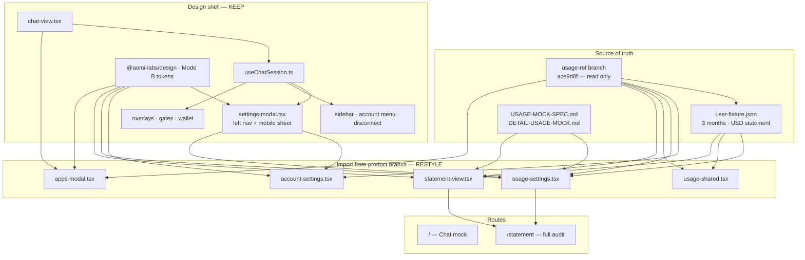

---

## Layer model

| Layer | Owner | Responsibility |
|-------|-------|----------------|
| **Fixture** | Product fixture (`user-fixture.json`) | Pre-rolled billing, wallets, grants — FE reads only |
| **Contracts** | Merge | TypeScript shapes mirroring fixture + chat session |
| **Session** | Design shell (`useChatSession`) | Overlays, tabs, gates, thread lifecycle |
| **Shell** | Design shell | Sidebar, header, composer, settings chrome, login/logout |
| **Panels** | Product panels, design shell styling | Account ACL, Usage matrix, statement, apps store |

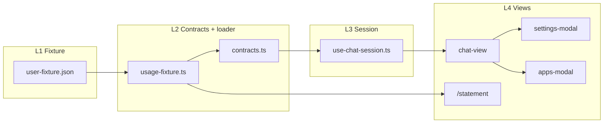

---

## Principles (non‑negotiable)

| Keep (design shell) | Import from product branch |
|----------------------|------------------------|
| Left settings rail + mobile tab pills | Account ACL tab content |
| Sidebar account menu + **Disconnect** + `DisconnectModal` | Usage summary + by-app matrix |
| `useChatSession` (send/stop/trace/gates/menus) | `/statement` page |
| Composer pickers + command menu | Apps modal (store) |
| `@aomi-labs/design`, design tokens, brand marks | `user-fixture.json` + specs |
| Payment + secret gate overlays | General identity card + “Manage account” |

**Do not:** replace `chat-view` with the source branch static shell, keep two billing mocks, or port `aomi-build` invoice UI.

**Merge mindset:** Product features + design shell + one fixture. You are **integrating product direction into a stronger interaction layer** — not copying the source branch wholesale.

---

## Locked decisions (unless product confirms otherwise)

| Topic | Decision |
|-------|----------|
| Settings left nav | **Keep design shell** — desktop rail + mobile sheet |
| Login / logout | **Keep** sidebar account menu + General Disconnect + confirm modal |
| Settings tabs | **6 tabs:** General · **Account** · Usage · App Keys · Bots · Secrets *(drop standalone BYOK — app BYOK lives in Usage/statement)* |
| Billing data | **`user-fixture.json`** is SSOT; **deprecate** `billing-fixtures.ts` (adapter shim) in S1, **delete** only in S6 when nothing imports it |
| Git workflow | Commit local WIP first (~8 commits), then branch **`feat/merge-settings-usage`** for settings/usage merge (~8 commits), merge PR → **22 commits total** |
| Sidebar credits | Show **allowance** from fixture: `500/500` + “X left” or “allowance used” — align with Usage tab |
| x402 in chat UI | **OK in Usage/statement** status lines (usage mock spec); not in Build-style invoice tables |
| Apps entry | **Header Apps button** → full modal; composer app picker stays for “active chat app” |
| Gate reroutes | Drop `onOpenByok` / BYOK tab; payment gate **View usage** → `usage`; **Use own key** → `secrets` |
| Contract lock | **S1 must finish before any UI port** — types frozen, fixture loads, `tsc` green |

---

## Execution refinements (review consensus)

Adopted from plan review — adjust execution, not direction.

| Refinement | Action |
|------------|--------|
| **Contract lock** | S1 ends only when fixture + contracts compile; **no panel ports until then** |
| **Deprecate, don't delete** | `billing-fixtures.ts` becomes a thin adapter over `user-fixture` in S1; delete in S6 |
| **Feature branch** | Merge work on `feat/merge-settings-usage`, not directly on `main` |
| **Per-sprint cleanup** | After each sprint: `tsc --noEmit` → remove dead imports → commit (don't wait for Phase 11) |
| **Merge by feature** | Within sprints, ship incrementally (summary → meter → matrix → statement link) |
| **Account file split** | Optional — port `account-settings.tsx` monolith first; split into subcomponents later if time allows |

**Biggest technical risk:** changing contracts mid-merge. The chain `user-fixture.json → contracts → useChatSession → Settings → Statement → sidebar → GateModal` must stay stable once S1 lands.

---

## Git workflow & commit plan (22 total)

### Phase A — Land design shell WIP on `main` (commits 6–13)

Commit local craft **before** starting settings/usage merge. Target **8 commits**:

| # | Commit | Scope |
|---|--------|-------|
| 6 | Design tokens + Mode B globals | `design-tokens.css`, `globals.css`, layout |
| 7 | Brand system | `brand-mark`, `app-brands`, `brands` |
| 8 | Contracts expansion | Session, gates, settings types |
| 9 | Fixtures expansion | Threads, catalogs, wallets |
| 10 | `useChatSession` controller | Overlays, lifecycle, thread state |
| 11 | Overlays + menus + disconnect | `overlays.tsx`, `menus.tsx`, `DisconnectModal` |
| 12 | Shell polish | sidebar, header, composer, working trace |
| 13 | Settings + billing simulation | left-nav modal, tab panels, `billing-fixtures.ts` |

*(Commits 1–5 already exist: scaffold, vibe mock, logo, checkpoint.)*

### Phase B — Settings/usage merge on `feat/merge-settings-usage` (commits 14–21)

| # | Commit | Sprint |
|---|--------|--------|
| 14 | Add merge plan and usage mock specs | docs |
| 15 | S1 — fixture, contracts, billing adapter | S1 |
| 16 | S2a — settings nav + Account tab shell | S2 |
| 17 | S2b — port `account-settings.tsx` | S2 |
| 18 | S3 — Usage tab + `usage-shared.tsx` | S3 |
| 19 | S4 — `/statement` route | S4 |
| 20 | S5 — Apps modal + session wiring | S5 |
| 21 | S6 — cleanup, delete billing shim, icons, QA | S6 |

### Phase C — Integration (commit 22)

| # | Commit | Action |
|---|--------|--------|
| 22 | Merge `feat/merge-settings-usage` → `main` | PR merge |

```bash
# After Phase A commits are pushed:
git checkout -b feat/merge-settings-usage
git fetch origin feat/settings-usage-statement
git branch usage-ref origin/feat/settings-usage-statement   # read-only
```

### Commit message templates (no personal names)

Use imperative mood, ≤72 chars subject, scope in body if helpful.

**Phase A (design shell):**

```text
Add Mode B design tokens and global theme wiring
Add brand marks and app/network icon system
Expand chat contracts for session, gates, and settings
Expand fixtures for threads, catalogs, and wallets
Add useChatSession controller for overlays and lifecycle
Add disconnect flow, account menu, and gate overlays
Polish chat shell: sidebar, composer, and working trace
Add settings modal with left nav and billing simulation
```

**Phase B (settings/usage merge):**

```text
Add merge plan and usage mock specs
Add user-fixture loader and billing adapter shim
Add Account tab to settings shell
Port account ACL settings panel
Port usage summary and by-app matrix
Add statement route and itemized audit view
Add apps store modal and header entry point
Wire session overlays and remove legacy billing shim
```

**PR title (commit 22):**

```text
Merge settings and usage into chat design shell
```

---

## Product parity checklist (release gate)

Use this alongside Phase 12 QA. All must pass before merge PR.

### Usage & billing

- [ ] Usage summary (Models / Tool calls / On-chain / Total USD)
- [ ] Credits meter + allowance line
- [ ] x402 overflow copy when applicable
- [ ] By-app matrix (`—` vs `$0.00` vs amounts)
- [ ] Statement link from Usage tab

### Statement

- [ ] Month selector (3 months)
- [ ] By app view
- [ ] Itemized view
- [ ] App filter + subject chips

### Account ACL

- [ ] Wallet groups + signing modes
- [ ] Drift detection + re-grant
- [ ] Delegated grants + revoke
- [ ] Stop all auto-signing

### Apps (two surfaces)

- [ ] Header Apps modal (store, install)
- [ ] Composer app picker (thread-scoped) — unchanged

### Design shell (must not regress)

- [ ] Left settings nav + mobile pills
- [ ] Sidebar disconnect → `DisconnectModal`
- [ ] Settings General disconnect → same flow
- [ ] Payment gate → View usage
- [ ] Secret gate → Open secrets
- [ ] Working trace · tx approve/reject
- [ ] App Keys · Bots · Secrets tabs

---

## User journey map

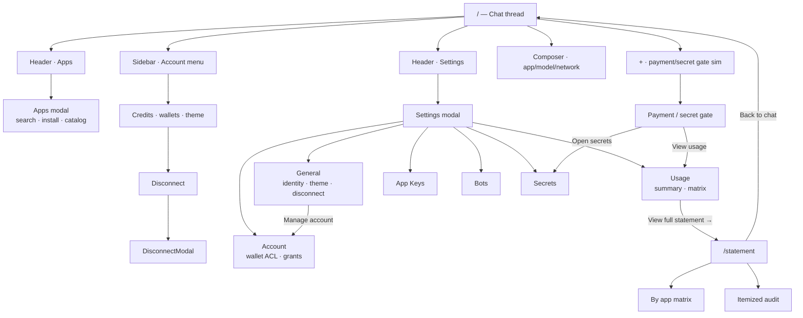

---

## Settings modal architecture

Design shell chrome wraps product panel bodies. Login/logout never moves off General + sidebar.

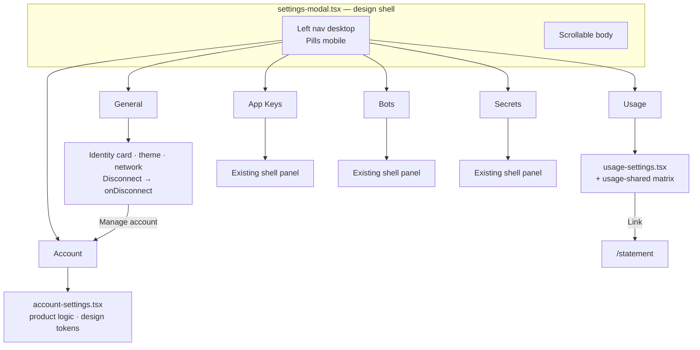

---

## Billing & usage data model

User charged on **three subjects**, attributed to **the app**:

| Subject | Meaning |
|---------|---------|
| **model** | LLM turns |
| **tool use** | Per-call app tools |
| **outcome** | On-chain fees (flow × bps) |

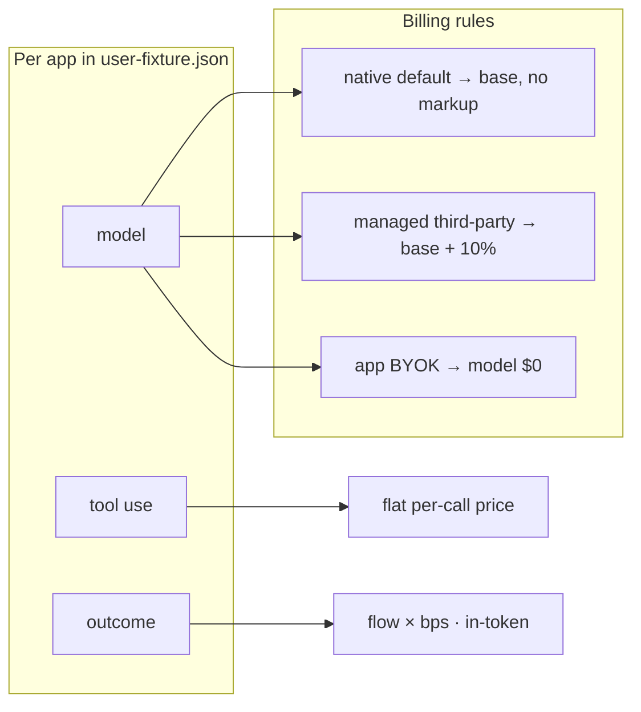

**Drill path:**

```text
Settings › Usage (summary + frameless matrix)
    └─ "View full statement →"
         /statement (month picker · By app | Itemized · filters)
```

**Fixture rules (from spec):**

- User never BYOKs (`account.byok: false`).
- “BYOK” is an **app setting**, not a user settings tab.
- `—` = app doesn't charge that subject; `$0.00` = charged zero (app BYOK).

---

## Account ACL architecture

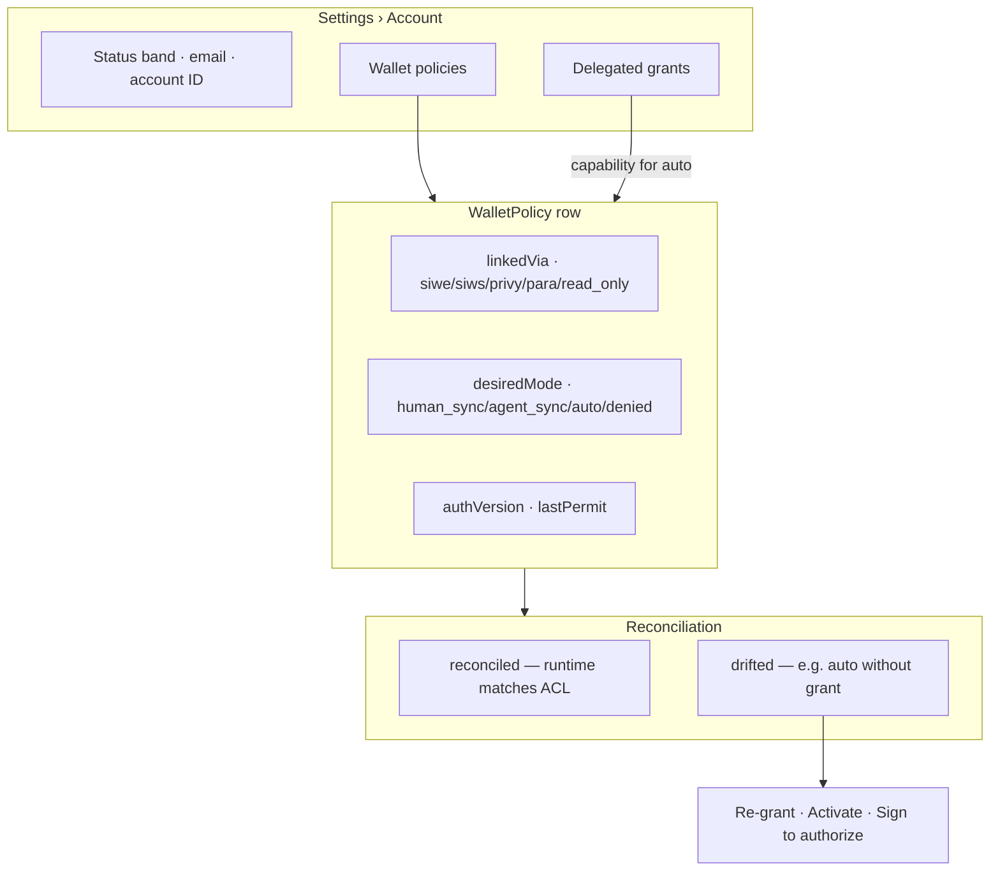

---

## Overlay & session state

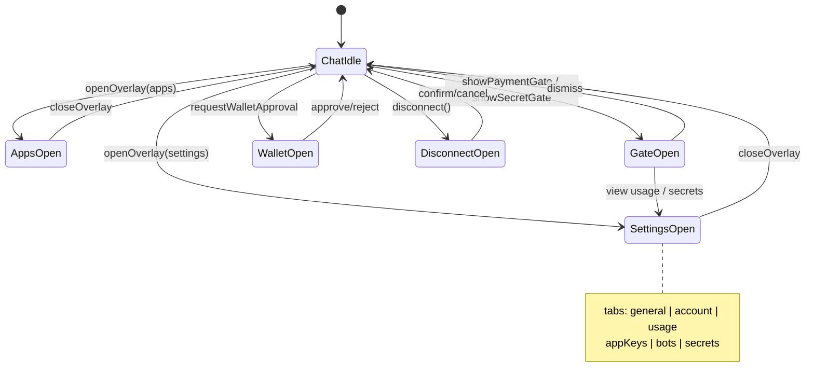

---

## Apps: two surfaces

| Surface | Entry | Job |
|---------|-------|-----|
| **Apps modal** | Header Apps button | Browse store, install apps |
| **Composer picker** | App chip / `+` menu | Pick active app for this thread |

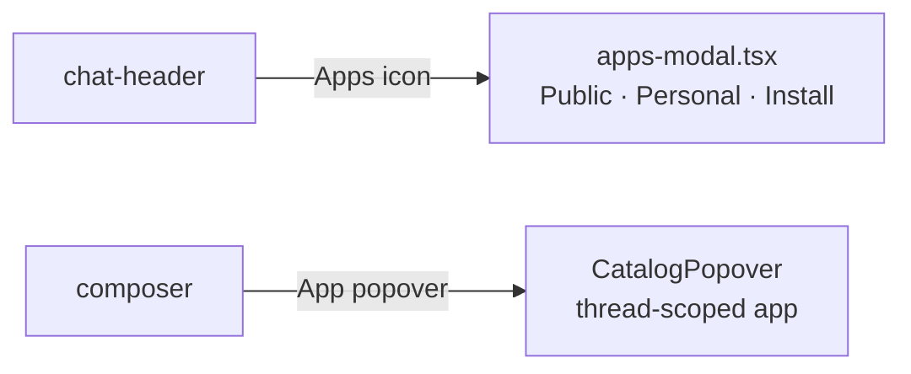

---

## Phase 0 — Prep (~30 min)

**Prerequisite:** Phase A commits (6–13) landed on `main` — local WIP is committed, not sitting dirty.

```bash
cd aomi-portal
git checkout main && git pull   # after Phase A pushed
git checkout -b feat/merge-settings-usage
git fetch origin feat/settings-usage-statement
git branch usage-ref origin/feat/settings-usage-statement  # read-only reference
```

- [ ] Snapshot current local: list modified files
- [ ] Read on reference branch: `USAGE-MOCK-SPEC.md`, `DETAIL-USAGE-MOCK.md`
- [ ] Confirm tab list with product if App Keys/Bots/Secrets should move

---

## Phase 1 — Data layer (copy, don’t checkout)

**Add from `usage-ref`:**

| File | Action |
|------|--------|
| `user-fixture.json` | Copy to repo root |
| `USAGE-MOCK-SPEC.md` | Copy |
| `DETAIL-USAGE-MOCK.md` | Copy |
| `src/features/chat/usage-fixture.ts` | Copy (imports JSON) |

**Configure JSON import** (if missing):

- `tsconfig.json`: `"resolveJsonModule": true`
- Next already supports JSON imports

**Deprecate (do not delete yet):**

- `src/features/chat/billing-fixtures.ts` → convert to **adapter shim** that reads `user-fixture.json` internally and re-exports legacy shapes (`AccountBillingSnapshot`, `UsageOverview`) so existing imports keep compiling during the merge. Delete only in **S6**.

---

## Phase 2 — Contracts merge (`contracts.ts`)

**Merge types** — extend existing contracts, don't replace wholesale.

### From product branch (add)

- `AccountOverview`, `WalletPolicy`, `DelegationGrant`
- `SignerMode`, `LinkedVia`
- `UsageFixtureData`, `MonthlyStatement`, `AppUsageEntry`, …
- `UsageStatement` (flat rollup — optional compat)

### Keep from design shell

- `SessionState`, `ChatSnapshot`, `Overlay` types — extend with `"apps"`
- `Gate` + `paymentActions` (payment/secret gates)
- `Thread`, `ToolStep`, `TxPreview`, catalog types
- Composer/popover types

### Update

```typescript
export type SettingsTab =
  | "general"
  | "account"    // NEW
  | "usage"
  | "appKeys"
  | "bots"
  | "secrets";

export type Overlay =
  | "none" | "wallet" | "settings" | "wallets" | "gate"
  | "disconnect" | "deleteThread"
  | "apps";      // NEW
```

---

## Phase 3 — Fixtures merge (`fixtures.ts`)

**From product branch — add:**

- `seedAccountOverview`
- `seedWalletPolicies` (7 wallets, all reconciliation states)
- `seedGrants`

**Align `seedAccount`:**

- Pull handle/tier from `user-fixture.json` → `account` block where useful
- Sidebar credits: derive from `months[0].payment.allowanceCredits`

**Keep from design shell:**

- Threads, traces, tx, apps/models/networks catalogs, command items, gates

**Remove:**

- `usageRows` (replaced by usage fixture)

**Route through adapter (until S6):**

- Existing `billing-fixtures.ts` imports stay working via shim; new code imports `usage-fixture.ts` directly

---

## Phase 4 — Settings shell (design chrome, product panels)

**File:** `settings-modal.tsx` — **keep structure**, swap tab bodies.

### Left nav (desktop) — final order

1. General
2. **Account** ← new
3. Usage
4. App Keys
5. Bots
6. Secrets

### Mobile

- Keep sheet handle, account chip, horizontal pill scroll
- Add **Account** pill

### Props

```typescript
interface SettingsModalProps {
  theme: Theme;
  tab: SettingsTab;
  address: string;
  network: string;
  account: AccountOverview;      // product branch shape
  wallets: WalletPolicy[];
  grants: DelegationGrant[];
  onSetTheme: (t: Theme) => void;
  onSetTab: (tab: SettingsTab) => void;
  onDisconnect: () => void;      // KEEP — opens disconnect flow
  onClose: () => void;
  onManageAccount?: () => void;  // General → Account tab
}
```

### Tab routing

| Tab | Component | Source |
|-----|-----------|--------|
| `general` | Inline or `general-settings-panel.tsx` | Merge product identity card + shell theme/network/disconnect |
| `account` | `account-settings.tsx` | Port from product branch, restyle tokens |
| `usage` | `usage-settings.tsx` | Port from product branch, restyle tokens |
| `appKeys` | existing panel | Keep shell |
| `bots` | existing panel | Keep shell |
| `secrets` | existing panel | Keep shell |

**Styling pass on ported panels:**

- Replace hardcoded `px-[22px]` with shell spacing
- Use `@aomi-labs/design` `Button` where source branch used raw buttons
- Match `SettingRow` / `Divider` from existing modal
- Mobile: ensure Account/Usage scroll inside sheet max-height

---

## Phase 5 — General tab upgrade

**Merge product identity content into General tab:**

- [ ] Identity card (avatar, address, auth badge, primary identity)
- [ ] **Manage account** → `onSetTab("account")` (not a separate login)
- [ ] Meta grid: Type · Network
- [ ] Theme toggle (existing)
- [ ] Default network (existing + `NetworkMark`)
- [ ] **Disconnect** button → `onDisconnect()` (unchanged)

**Do not add** a second logout path.

---

## Phase 6 — Account tab (`account-settings.tsx`)

**Port file from product branch (~874 lines), then restyle.**

### Feature checklist (all must work in simulation)

- [ ] Status band: email, account ID copy, wallet/grant counts
- [ ] “Needs attention” chip → scroll + expand drifted wallet + flash
- [ ] Sort: custody vs chain
- [ ] Wallet groups: self-custody · embedded · read-only
- [ ] Wallet cards: provider tag, address, primary, mode pill
- [ ] Read-only → **Activate** (simulated SIWE upgrade)
- [ ] Signing mode grid: Manual · Accept tx · Auto · Locked
- [ ] Invalid modes greyed + tooltip reason
- [ ] Draft mode → **Sign to authorize** → commit (bumps `authVersion`)
- [ ] Drifted auto (Para expired) → **Re-grant**
- [ ] Delegated grants list + revoke
- [ ] **Stop all auto-signing**

### Session wiring

```typescript
// use-chat-session.ts
seedWalletPolicies, seedGrants in state (or read-only from fixtures)
openOverlay("settings", "account") from General "Manage account"
```

---

## Phase 7 — Usage tab (`usage-settings.tsx` + `usage-shared.tsx`)

**Port both files from product branch.**

### Usage tab checklist

- [ ] Header: `Usage · {periodLabel}`
- [ ] Summary rows: Models / Tool calls / On-chain / **Total** (USD)
- [ ] Credits line: `{used}/{included} · paid via {settledVia}`
- [ ] Meter + x402 overflow copy when `x402SettledUsd > 0`
- [ ] Link: **View full statement →** `/statement` (Next `Link`, new tab OK)
- [ ] Frameless **By app** matrix below summary
- [ ] Matrix: `—` vs `$0.00` vs amounts; hover tooltips

### `usage-shared.tsx` — shared by Usage tab + `/statement`

- [ ] `usd()`, `formatTokens()`, `modelName()`, `MatrixTable`, `Meter`
- [ ] `AppGroup`, itemized tables, billing chips (native / +10% / app key)
- [ ] Restyle borders/colors to design tokens (`border-border`, `text-muted`, etc.)

---

## Phase 8 — `/statement` route

**Add files:**

```text
src/app/statement/page.tsx
src/features/chat/components/statement-view.tsx
```

### Statement page checklist

- [ ] `← Back to chat` → `/`
- [ ] Account header: handle · truncated address
- [ ] Month dropdown (3 months from fixture)
- [ ] Stat tiles: Total, Models, Tool calls, On-chain
- [ ] Payment strip + meter
- [ ] Toggle: **By app** | **Itemized**
- [ ] App filter dropdown
- [ ] Itemized subject chips: All · Models · Tool calls · On-chain
- [ ] Itemized Section A (compute) + Section B (on-chain)
- [ ] App billing chips per group
- [ ] Footer recipients (when unfiltered)

### Layout

- Wrap in `layout.tsx` tokens (dark class, font)
- Standalone page without chat sidebar (per usage mock spec)

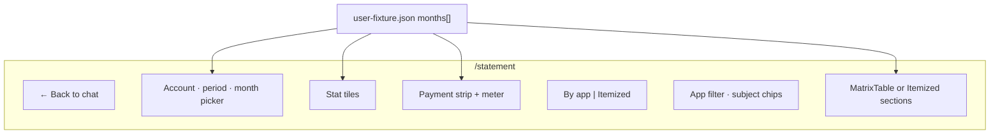

---

## Phase 9 — Apps modal (`apps-modal.tsx`)

**Port from product branch, restyle to Mode B.**

### Wire in `chat-view.tsx` + `use-chat-session.ts`

```typescript
overlay === "apps" → <AppsModal onClose={closeOverlay} />
```

### Header

- [ ] Add **Apps** button in `chat-header.tsx`
- [ ] `onOpenApps={() => openOverlay("apps")}`

### Apps modal checklist

- [ ] Full-screen overlay, scrollable
- [ ] Search filters catalog
- [ ] Installed icon strip + gear (stub OK)
- [ ] Public / Personal tabs
- [ ] Categories + app rows + Install / ⋯
- [ ] Local install state (`useState` Set)
- [ ] Escape closes
- [ ] Use `@aomi-labs/design` buttons; match chat elevation/shadows

**Keep** composer `CatalogPopover` for per-thread app — different job from store.

---

## Phase 10 — Session + shell wiring

### `use-chat-session.ts`

- [ ] `Overlay` includes `"apps"`
- [ ] `SettingsTab` includes `"account"`
- [ ] Pass `seedAccountOverview`, wallets, grants to settings
- [ ] `openOverlay("settings", "account")` from General “Manage account”
- [ ] Payment gate: View usage → `usage`; Use own key → `secrets`
- [ ] Update `paymentGate` copy to allowance/x402 language from fixture
- [ ] Remove `onOpenByok` / BYOK tab routing (BYOK is app-level in Usage/statement, not a user tab)

### `chat-view.tsx`

- [ ] SettingsModal new props
- [ ] AppsModal overlay
- [ ] GateModal unchanged structure; drop BYOK action handlers

### Login / logout (verify unchanged)

- [ ] Sidebar → account menu → Disconnect → `DisconnectModal` → `confirmDisconnect`
- [ ] Settings General → Disconnect → same flow
- [ ] No alternate auth path from source branch

### Sidebar / account menu copy

- [ ] Credits from `user-fixture.json` month 0 allowance
- [ ] Example: `0 credits left · allowance 500/500 used` when exhausted

---

## Phase 11 — Icons + cleanup

**From source branch `icons.tsx` — merge new icons only:**

- Apps, Filter, Help, Alert, Bolt, Copy, Star, ExternalLink, ArrowLeft, …

**Remove / consolidate (S6 — only when adapter has zero importers):**

- [ ] Delete `billing-fixtures.ts` adapter shim
- [ ] Remove dead imports of `usageRows`, old Usage table in settings-modal
- [ ] Remove legacy `AccountBillingSnapshot` / `UsageOverview` if fully replaced
- [ ] `pnpm exec tsc --noEmit` clean
- [ ] `pnpm run build` clean

**Per-sprint habit (every sprint, not just S6):**

```text
Sprint N work → pnpm exec tsc --noEmit → dead imports gone → commit
```

---

## Phase 12 — Click-through QA (demo script)

### Chat shell (design layer)

1. New chat · send · working trace · tx approve/reject
2. `+` menu · simulate payment gate · simulate secret gate
3. Composer app/model/network pickers
4. Sidebar collapse · thread select

### Settings (merged)

5. Open settings — **left nav visible** desktop + mobile pills
6. General → identity → Manage account → lands on **Account**
7. General → Disconnect → confirm modal
8. Account → expand wallet → change mode → sign to authorize
9. Account → drifted Para → re-grant
10. Account → stop all auto-signing
11. Usage → numbers match `DETAIL-USAGE-MOCK.md` July ($83.79 total)
12. Usage → matrix tooltips · View full statement

### Statement

13. `/statement` → month picker (3 months)
14. By app · Itemized · app filter · subject filter
15. Back to chat

### Apps

16. Header Apps → search → install → installed strip updates
17. Escape closes

---

## File action matrix

| File | Action |
|------|--------|
| `user-fixture.json` | **Add** |
| `USAGE-MOCK-SPEC.md`, `DETAIL-USAGE-MOCK.md` | **Add** |
| `MERGE-PLAN.md` | **This doc** |
| `usage-fixture.ts` | **Add** |
| `usage-shared.tsx` | **Add** (port + restyle) |
| `usage-settings.tsx` | **Add** (port + restyle) |
| `account-settings.tsx` | **Add** (port + restyle) |
| `statement-view.tsx` | **Add** (port + restyle) |
| `apps-modal.tsx` | **Add** (port + restyle) |
| `app/statement/page.tsx` | **Add** |
| `contracts.ts` | **Merge** types + tabs |
| `fixtures.ts` | **Merge** wallet/grant seeds |
| `settings-modal.tsx` | **Extend** nav + tab routing; keep shell |
| `billing-fixtures.ts` | **Deprecate** (adapter shim) in S1; **delete** in S6 |
| `chat-header.tsx` | **Add** Apps button |
| `chat-view.tsx` | **Wire** new overlays/props |
| `use-chat-session.ts` | **Wire** apps overlay, account tab, fixture credits |
| `icons.tsx` | **Merge** new icons |
| `overlays.tsx` | **Keep** + update payment gate copy |
| `menus.tsx`, `sidebar.tsx` | **Keep** + allowance copy |
| App Keys / Bots / Secrets panels | **Keep** in settings-modal |

---

## Sprint plan

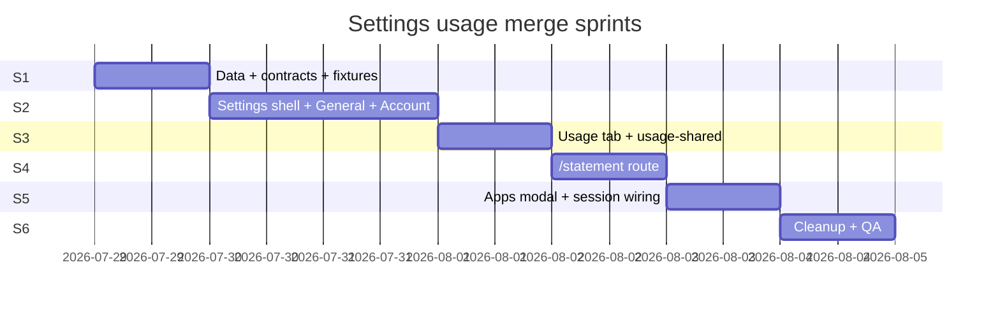

| Sprint | Phases | Deliverable | ~effort | Exit criteria |
|--------|--------|-------------|---------|---------------|
| **S1** | 0–3 | JSON, contracts, fixtures, billing adapter | 2–3 h | **`tsc` green; fixture loads; types frozen; no UI ports** |
| **S2** | 4–6 | Settings shell + General + Account | 4–6 h | Account tab works in design shell; BYOK tab removed |
| **S3** | 7 | Usage tab + usage-shared | 3–4 h | July totals match spec ($83.79); matrix + statement link |
| **S4** | 8 | `/statement` | 3–4 h | Month picker, By app, Itemized, filters |
| **S5** | 9–10 | Apps modal + session wiring | 2–3 h | Apps overlay + gate/sidebar copy updated |
| **S6** | 11–12 | Cleanup + QA | 2 h | Billing shim deleted; product parity checklist green |

**Total:** ~16–22 h focused work.

### S1 hard gate (do not skip)

S1 is complete **only when all of these are true:**

1. `user-fixture.json` + `usage-fixture.ts` copied and loading
2. `contracts.ts` merged — product branch types + session types coexist
3. `billing-fixtures.ts` is adapter-only (reads fixture, no standalone mock data)
4. `pnpm exec tsc --noEmit` passes with **zero** panel ports started
5. Types are treated as **frozen** — no shape changes during S2–S5

Only then start UI (S2).

---

## Portal integration (future — out of scope)

When moving mock → `apps/portal`:

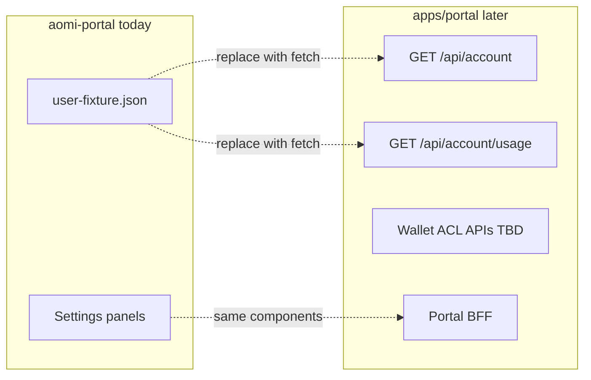

---

## Out of scope (this pass)

- `apps/portal` integration
- Real API fetch (`/api/account/usage`, payment)
- Build billing guidance page
- Removing App Keys / Bots / Secrets tabs (kept unless product confirms fold)
- Mobile-specific statement layout (usable desktop-first OK for mock)

---

## Start coding

### Step 1 — Commit WIP (Phase A, commits 6–13)

Land local craft on `main` in ~8 focused commits **before** settings/usage merge. See [Git workflow & commit plan](#git-workflow--commit-plan-22-total).

### Step 2 — Branch + S1 (commit 15)

```bash
git checkout -b feat/merge-settings-usage
```

Begin **S1** on the feature branch (do **not** checkout the source branch minimal `chat-view`):

1. Copy data files from `usage-ref`
2. Merge `contracts.ts`
3. Add `billing-fixtures.ts` adapter shim
4. **`tsc --noEmit` green — stop. Do not port UI yet.**

### Step 3 — S2+ (commits 16–21)

5. Extend `settings-modal` nav with **Account**; drop BYOK tab
6. Port **Account** + **Usage** panels into design shell
7. Continue S3–S6 per sprint table; cleanup + commit after each sprint

Login/logout and left settings section stay throughout.

**Reference branch:** https://github.com/aomi-labs/aomi-portal/tree/feat/settings-usage-statement
